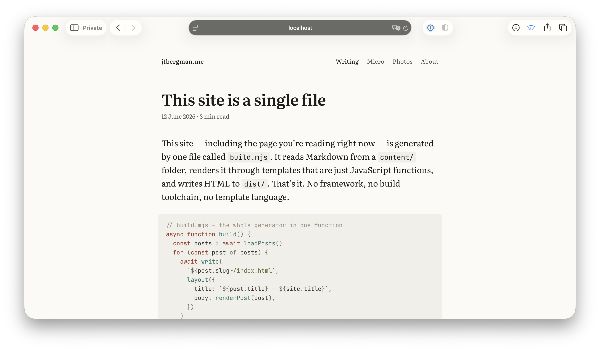
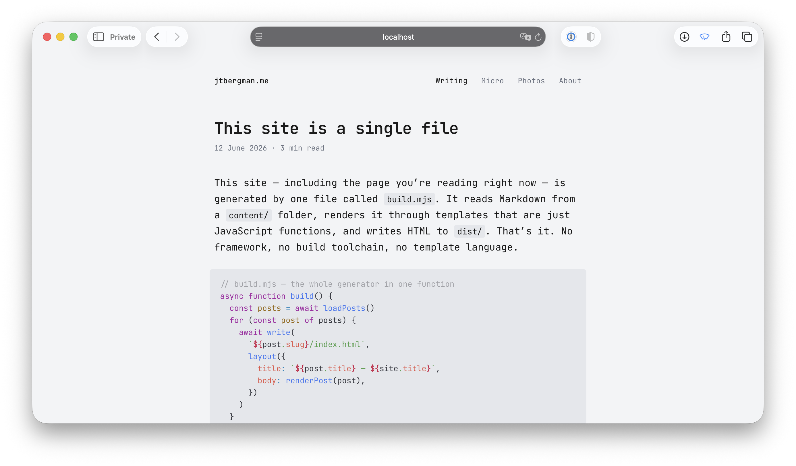
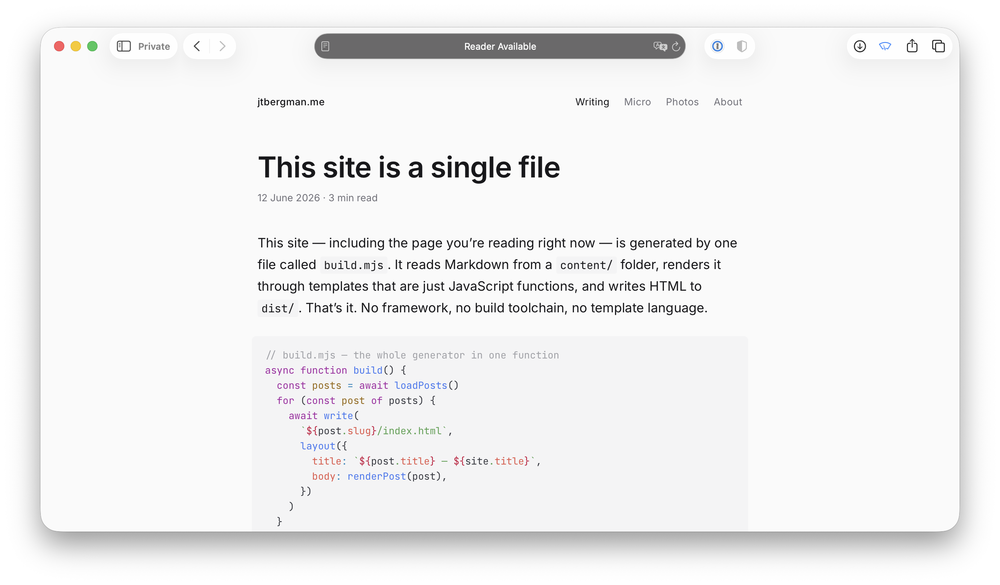

This site — including the page you're reading right now — is generated by one file called `build.mjs`. It reads Markdown from a `content/` folder, renders it through templates that are just JavaScript functions, and writes HTML to `dist/`. That's it. No framework, no build toolchain, no template language.

```js
// build.mjs — the whole generator in one function
async function build() {
  const posts = await loadPosts()
  for (const post of posts) {
    await write(
      `${post.slug}/index.html`,
      layout({
        title: `${post.title} — ${site.title}`,
        body: renderPost(post),
      })
    )
  }
}
```

A full rebuild takes about 130 milliseconds.

## Themes

The look is controlled by a handful of CSS custom properties — colors, fonts, spacing. Every theme is just a `:root` block that overrides them. The structural styles in `style.css` never change:

```css
/* Each theme fits in ~18 lines of :root variables.
   style.css uses these tokens exclusively — no hardcoded colors. */
:root {
  --ink: #1c1b19;
  --paper: #fbfaf7;
  --accent: #9c3a2b;
  --font-body: "Literata", Georgia, serif;
  /* ... 8 more tokens ... */
}
```

Three themes ship with the repo:

| Theme | Font | Accent |
|---|---|---|
| **default** | Literata + JetBrains Mono | Amber |
| **terminal** | JetBrains Mono everywhere | Green |
| **sans** | Inter + JetBrains Mono | Indigo |







You switch between them by changing one line in `build.mjs`. Adding a fourth theme means writing 18 lines of CSS variables, adding one entry to a font map, and picking a Shiki palette — about five minutes of work.

The whole CSS story is `style.css` (structural rules) plus three 18-line theme files. **54 lines of tokens total.** Every color, font, and spacing decision lives in exactly one place.

## Fork it, make it yours

The repository is at [github.com/jtbergman/jtbergman.github.io](https://github.com/jtbergman/jtbergman.github.io). You can fork it, point the `site` config at your name, replace the Markdown files with your own writing, and deploy to GitHub Pages in about ten minutes. The Atom feed, the photo gallery, the micro blog — they all just work.

I built most of this by asking an AI to make changes. This is a good project for that because:

- **It's small.** You can read every line of the generator in one sitting. If the AI makes a mistake, you can find it.
- **It has no hidden state.** No database, no build cache, no framework internals. The output is determined entirely by your `content/` folder.
- **The contract is simple.** Every page body is a `<main>` (or `<article>` for posts). The CSS hooks on `data-page` attributes. Templates are functions that return strings.

The tool I use is [OpenCode](https://opencode.ai) running in [Warp](https://www.warp.dev) with [DeepSeek V4 Flash](https://deepseek.com) — fast enough that edits feel interactive. If you want better reasoning for harder changes, you can swap to a pay-as-you-go [Zen](https://opencode.ai/zen) model without changing anything else. OpenCode is open source, works in any terminal, and supports any provider.

The point is: you don't need a complex SSG or a CMS. You need a `content/` folder, a `build.mjs`, and something to put on the internet. Everything else is optional.

## Oh, and it supports a custom quiz component

This quiz below is implemented as a web component. See [Plain Vanilla](https://plainvanillaweb.com/pages/components.html) for more info about that. If you inspect the HTML for this site, you will actually see the custom `<quiz-set>` and `<quiz-question>` HTML elements in the source.

<quiz-set>
  <quiz-question idk>
    <p>What does this site use to render Markdown to HTML?</p>
    <ul>
      <li>Next.js and MDX</li>
      <li correct><code>markdown-it</code> with Shiki syntax highlighting</li>
      <li>A custom parser written from scratch</li>
    </ul>
    <p data-explain><code>build.mjs</code> imports markdown-it and Shiki. Two dependencies, zero framework.</p>
  </quiz-question>
  <quiz-question>
    <p>How long does a full rebuild of this site take?</p>
    <ul>
      <li>About 3 seconds</li>
      <li correct>About 130 milliseconds</li>
      <li>About 45 seconds</li>
    </ul>
    <p data-explain>There's no incremental build — it's just fast enough not to need one.</p>
  </quiz-question>
</quiz-set>
