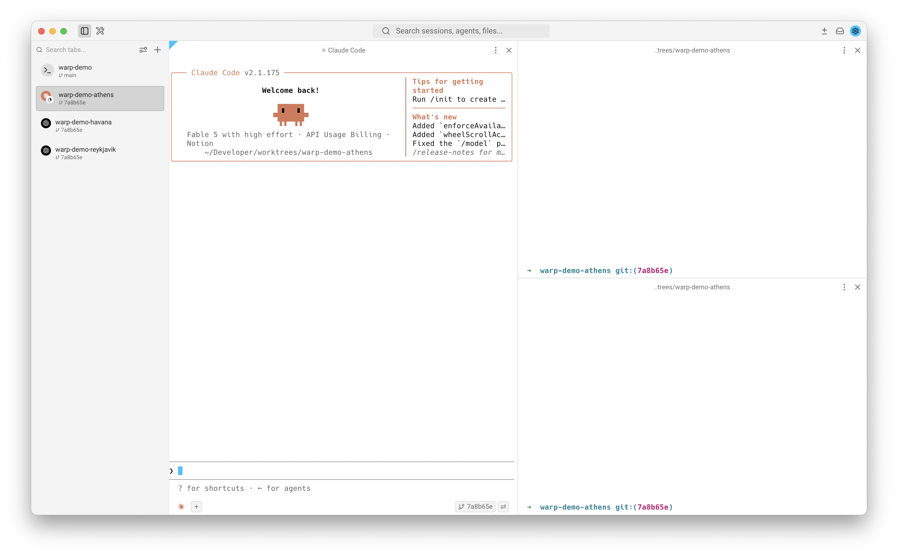

At work, I use Git worktrees to keep my various tasks isolated. [Conductor](https://conductor.build) provides a great UI for this exact workflow, and it encourages you to create a new worktree for each task and discard it when you're done. It also supports setup and teardown scripts to make the process customizable.

But Conductor can be a bit resource heavy, and I prefer to keep my agents running in my terminal. I also want control over my workflow, and I don't want it to experience constant product churn. Furthermore, my repository is large enough that worktrees take several minutes to create, so I primarily *reuse* them rather than recreating them. I also have a preferred UI layout: each worktree gets its own tab with one pane for coding agents, one pane to `tail -f` log files, and one pane for running `git` and `make` commands.

This post shows how I've configured Warp to look and behave like Conductor.

## The outcome



What you're looking at:

- **Warp's vertical tabs, one tab per worktree.** The main checkout is the tab at the top; every worktree gets its own tab below it.
- **Each worktree tab is split** so coding agents run in the large left pane, with two terminals stacked on the right.
- **Worktrees are created on demand** with `wt new`, recycled with `wt reuse`, and removed with `wt delete`. I've provided this shell script below.
- **Each repository gets its own terminal window**, opened from a Warp launch configuration that `wt regen` generates for you.

Like Conductor, worktrees are named after cities, so you can travel the world while you work.

## The developer experience

Once everything is set up, the flow is:

1. In your repository of choice, run `wt new` a few times to create worktrees.
2. Run `wt regen` to write the layout configuration (the `wt` commands also keep it updated automatically).
3. Press `ctrl-cmd-l` in Warp and pick your repository's configuration. *Tip: press `cmd-enter` instead of enter to open it in the current window.*

The full command set:

| Command | What it does |
|---|---|
| `wt new` | Fetch `origin/main` and create a new worktree |
| `wt reuse` | Reset the current worktree to a fresh `origin/main` |
| `wt delete` | Remove the current worktree (asks first, and warns if it's dirty) |
| `wt regen` | Configures the UI layout shown above |

## Try it for yourself

Setup should only take 5–10 minutes.

### Directory layout

`wt` needs no configuration files because it leans on two conventions:

1. Your main checkout stays wherever you prefer, say `~/Developer/myrepo`.
2. All worktrees share a single directory, `~/Developer/worktrees` (override with `WT_WORKTREES_DIR`).

Which repository a worktree belongs to is resolved from git itself: a worktree's `.git` file points back at its main checkout. That's how `wt` keeps repositories from contaminating each other's launch configurations, even though their worktrees share a directory.

### The `wt` script

Save this as `~/.local/bin/wt` and `chmod +x` it. Ensure this is on your `PATH`:

```bash
#!/usr/bin/env bash
# wt — git worktree workflow CLI.
#
#   wt new            create a <city>-named worktree detached at origin/main
#   wt reuse          fresh start on origin/main for the worktree around $PWD
#   wt delete [-y]    remove the worktree around $PWD (confirms unless -y)
#   wt regen          rewrite this repo's Warp launch config from disk state
#
# Optional hooks at ~/.config/wt/hooks/<repo>/{on-create,on-reuse,on-delete}.sh
# receive the worktree path as $1. Set WT_NO_HOOKS=1 to skip them.

set -euo pipefail

WORKTREES_DIR="${WT_WORKTREES_DIR:-$HOME/Developer/worktrees}"

CITY_NAMES=(
	tokyo kyoto osaka seoul taipei manila bangkok
	jakarta singapore hanoi mumbai delhi bangalore
	dhaka kathmandu colombo beijing shanghai chengdu
	sapporo fukuoka london paris berlin madrid
	barcelona rome milan vienna prague budapest
	warsaw lisbon athens helsinki oslo stockholm
	copenhagen dublin edinburgh amsterdam hamburg munich
	zurich geneva marseille sofia bucharest vilnius
	reykjavik boston chicago austin portland seattle
	denver miami atlanta dallas houston toronto
	montreal vancouver ottawa havana lima bogota
	santiago cairo casablanca marrakech dakar accra
	nairobi capetown dubai sydney melbourne auckland
	wellington
)

usage() {
	sed -n 's/^#   \(wt .*\)/  \1/p' "$0"
}

die() {
	echo "wt: $*" >&2
	exit 1
}

# A worktree's git-common-dir points at the main checkout's .git, from anywhere.
resolve_repo() {
	local common
	common="$(git rev-parse --path-format=absolute --git-common-dir 2>/dev/null)" ||
		die "not inside a git repository"
	ROOT_CHECKOUT="$(dirname "$common")"
	REPO_NAME="$(basename "$ROOT_CHECKOUT")"
	HOOKS_DIR="$HOME/.config/wt/hooks/$REPO_NAME"
	LAUNCH_CONFIG="$HOME/.warp/launch_configurations/$REPO_NAME-worktrees.yaml"
}

# The worktree containing $PWD; refuses the main checkout.
current_worktree() {
	local top
	top="$(git rev-parse --show-toplevel 2>/dev/null)" || die "not inside a git repository"
	[ "$top" = "$ROOT_CHECKOUT" ] && die "refusing to act on the main checkout ($top)"
	[ "$(dirname "$top")" = "$WORKTREES_DIR" ] || die "$top is not under $WORKTREES_DIR"
	echo "$top"
}

is_dirty() {
	[ -n "$(git -C "$1" status --porcelain)" ]
}

# Share the main checkout's CLAUDE.local.md with the worktree, if there is one.
ensure_claude_symlink() {
	local source="$ROOT_CHECKOUT/CLAUDE.local.md" target="$1/CLAUDE.local.md"
	[ -e "$source" ] || return 0
	if [ ! -e "$target" ] || [ -L "$target" ]; then
		ln -sf "$source" "$target"
	fi
}

random_worktree_name() {
	local i name
	for i in 1 2 3 4 5 6 7 8 9 10; do
		name="$REPO_NAME-${CITY_NAMES[$((RANDOM % ${#CITY_NAMES[@]}))]}"
		if [ ! -e "$WORKTREES_DIR/$name" ]; then
			echo "$name"
			return
		fi
	done
	echo "$REPO_NAME-$(head -c 200 /dev/urandom | LC_ALL=C tr -dc 'a-z0-9' | head -c 6)"
}

# Only directories whose git-common-dir resolves back to this repo.
list_repo_worktrees() {
	local dir
	for dir in "$WORKTREES_DIR"/*/; do
		dir="${dir%/}"
		[ -d "$dir" ] || continue
		if [ "$(git -C "$dir" rev-parse --path-format=absolute --git-common-dir 2>/dev/null)" = "$ROOT_CHECKOUT/.git" ]; then
			echo "$dir"
		fi
	done
}

# `bg` hooks detach (long installs); `sync` hooks block. Hook failures never
# block the worktree operation itself.
run_hook() {
	local mode="$1" script="$HOOKS_DIR/$2" worktree="$3"
	[ -n "${WT_NO_HOOKS:-}" ] && return 0
	[ -x "$script" ] || return 0
	if [ "$mode" = bg ]; then
		nohup "$script" "$worktree" >/dev/null 2>&1 &
		echo "hook $2 running in background (tail -f $worktree/.wt-hook.log)"
	else
		"$script" "$worktree" || echo "hook $2 failed (continuing)" >&2
	fi
}

# One plain tab for the main checkout, then a three-pane tab per worktree.
# split_direction: horizontal = side by side, vertical = stacked.
cmd_regen() {
	local tmp="$LAUNCH_CONFIG.tmp" dir name
	mkdir -p "$(dirname "$LAUNCH_CONFIG")"
	{
		cat <<-EOF
		---
		# GENERATED by \`wt regen\` for $ROOT_CHECKOUT — edits will be lost.
		name: $REPO_NAME worktrees
		windows:
		  - tabs:
		      - title: $(basename "$ROOT_CHECKOUT")
		        layout:
		          cwd: $ROOT_CHECKOUT
		EOF
		for dir in $(list_repo_worktrees); do
			name="$(basename "$dir")"
			ensure_claude_symlink "$dir"
			cat <<-EOF

			      - title: $name
			        layout:
			          split_direction: horizontal
			          panes:
			            - cwd: $dir
			              is_focused: true
			            - split_direction: vertical
			              panes:
			                - cwd: $dir
			                - cwd: $dir
			EOF
		done
	} >"$tmp"
	mv "$tmp" "$LAUNCH_CONFIG"
	echo "regenerated $LAUNCH_CONFIG"
}

cmd_new() {
	local name path
	mkdir -p "$WORKTREES_DIR"
	name="$(random_worktree_name)"
	path="$WORKTREES_DIR/$name"
	echo "creating worktree $name..."
	git -C "$ROOT_CHECKOUT" fetch origin
	git -C "$ROOT_CHECKOUT" worktree add --detach "$path" origin/main
	ensure_claude_symlink "$path"
	cmd_regen
	run_hook bg on-create.sh "$path"
	echo "created $path"
}

cmd_reuse() {
	local path name stash_note=""
	path="$(current_worktree)"
	name="$(basename "$path")"

	if is_dirty "$path"; then
		git -C "$path" stash push -m "wt: auto-stash before reuse of $name"
		stash_note="stashed, "
	fi

	git -C "$path" fetch origin

	local ahead
	ahead="$(git -C "$path" rev-list --count origin/main..HEAD)"
	if [ "$ahead" -eq 0 ]; then
		git -C "$path" reset --hard origin/main
		echo "reused $name (${stash_note}reset to origin/main)"
	else
		# Detach instead of resetting so the old branch stays reachable by name.
		git -C "$path" checkout --detach origin/main
		echo "reused $name (${stash_note}detached at origin/main; previous branch untouched)"
	fi
	run_hook bg on-reuse.sh "$path"
}

cmd_delete() {
	local yes="" path name
	[ "${1:-}" = "-y" ] || [ "${1:-}" = "--yes" ] && yes=1
	path="$(current_worktree)"
	name="$(basename "$path")"

	if [ -z "$yes" ]; then
		local marker=""
		is_dirty "$path" && marker=" (DIRTY)"
		printf 'Delete %s%s? [y/N] ' "$name" "$marker"
		local answer
		read -r answer
		case "$answer" in
		y | Y | yes) ;;
		*)
			echo "cancelled"
			return
			;;
		esac
	fi

	# The hook runs while the worktree still exists; then remove it.
	run_hook sync on-delete.sh "$path"
	cd "$ROOT_CHECKOUT"
	git -C "$ROOT_CHECKOUT" worktree remove --force "$path"
	cmd_regen
	echo "deleted $name (local branches untouched)"
}

case "${1:-}" in
new)
	resolve_repo
	cmd_new
	;;
reuse)
	resolve_repo
	cmd_reuse
	;;
delete)
	resolve_repo
	shift
	cmd_delete "$@"
	;;
regen)
	resolve_repo
	cmd_regen
	;;
-h | --help | help | "") usage ;;
*) die "unknown command '${1}' (try: wt help)" ;;
esac
```

Two behaviors worth knowing before you trust it: 
1. `wt new` creates worktrees *detached* at `origin/main` with no branch, so you'll want to use `git switch -c my-feature` once you have some changes ready.
2. `wt reuse` never destroys anything: dirty changes are auto-stashed (see `git stash list`), and if you have local commits it detaches rather than resetting, so your old branch stays reachable by name. This saves your from accidentally losing your work. 

### Hooks

If your repository needs per-worktree setup or teardown, add  executable `on-create.sh`, `on-reuse.sh`, and `on-delete.sh` scripts to `~/.config/wt/hooks/<repo-basename>/`. Each receives the worktree path as `$1`. The delete hook runs synchronously *before* removal, so you can clean things up while the directory still exists.

Here is how I use them:
- `on-create` creates an iOS simulator named after the worktree and pre-compiles my app.
- `on-reuse` will pre-compile the app with the latest changes from `origin/main`.
- `on-delete` deletes the worktree simulator and ensures build artifacts are deleted.

```bash
#!/bin/zsh
#
# Saved in ~/.config/wt/hooks/{repo-name}/on-create.sh
set -eo pipefail

WORKTREE="${1:?missing worktree path}"

cd "$WORKTREE"
{
  echo
  echo "=== $(date) on-create $WORKTREE ==="

  # Run any commands you would like to configure your workspace
  make sim/create
  make sim/install
  make sim/build

  # Use tail -f .wt-hook.log from your worktree to view progress
} >> "$WORKTREE/.wt-hook.log" 2>&1
```

### Launch it

With these steps out of the way, just `cd` into your repository and run the following:

```
# create your first worktree
wt new

# why not create your second worktree too?
wt new
```

Then press `ctrl-cmd-l` in Warp and you're in business.

## Check your understanding

<quiz-set>
  <quiz-question>
    <p>You just merged the PR you were working on in <code>myrepo-athens</code> and want to start the next task from a clean slate in the same worktree. Which command?</p>
    <ul>
      <li><code>wt new</code></li>
      <li correct><code>wt reuse</code></li>
      <li><code>wt delete</code> followed by <code>wt new</code></li>
      <li><code>wt regen</code></li>
    </ul>
    <p data-explain><code>wt reuse</code> resets the worktree you're standing in to a fresh <code>origin/main</code>. Deleting and recreating works too, but recreating worktrees is the slow path — reuse is the whole point.</p>
  </quiz-question>
  <quiz-question>
    <p>You removed a worktree by hand with <code>git worktree remove</code>, and now Warp's launch configuration shows a tab for a directory that no longer exists. What fixes it?</p>
    <ul>
      <li>Edit the YAML in <code>~/.warp/launch_configurations/</code></li>
      <li correct><code>wt regen</code></li>
      <li>Restart Warp</li>
    </ul>
    <p data-explain>The launch configuration is a generated file. <code>wt regen</code> rewrites it from the worktrees actually on disk. Hand-edits get overwritten the next time any <code>wt</code> command regenerates it, so don't edit the YAML directly</p>
  </quiz-question>
  <quiz-question idk>
    <p>You run <code>wt reuse</code> in a worktree with uncommitted changes. What happens to them?</p>
    <ul>
      <li>They're lost — reuse hard-resets the worktree</li>
      <li correct>They're auto-stashed and recoverable via <code>git stash list</code></li>
      <li>The command refuses to run until you commit</li>
    </ul>
    <p data-explain>Dirty tracked changes are stashed with a descriptive message before anything else happens. Untracked files (build artifacts, logs) stay in place.</p>
  </quiz-question>
  <quiz-question>
    <p>After <code>wt new</code>, what branch is the new worktree on?</p>
    <ul>
      <li><code>main</code></li>
      <li>A fresh branch named after the city</li>
      <li correct>None — it's detached at <code>origin/main</code></li>
    </ul>
    <p data-explain>A workspace doesn't need a branch until there's work worth naming. Start one with <code>git switch -c my-feature</code> when the task takes shape.</p>
  </quiz-question>
</quiz-set>
